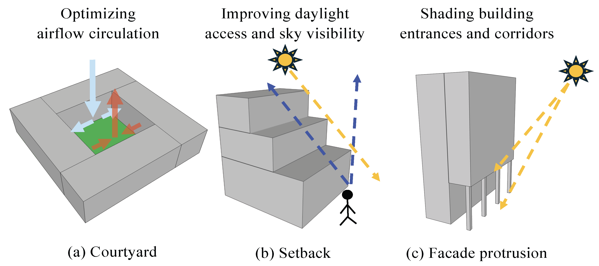
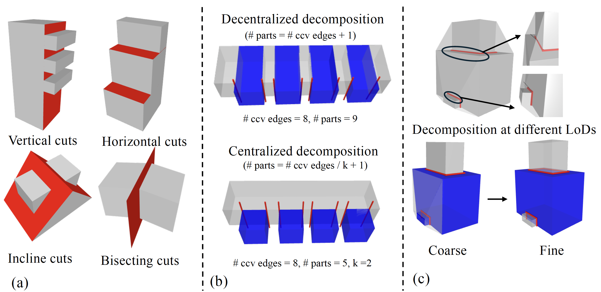
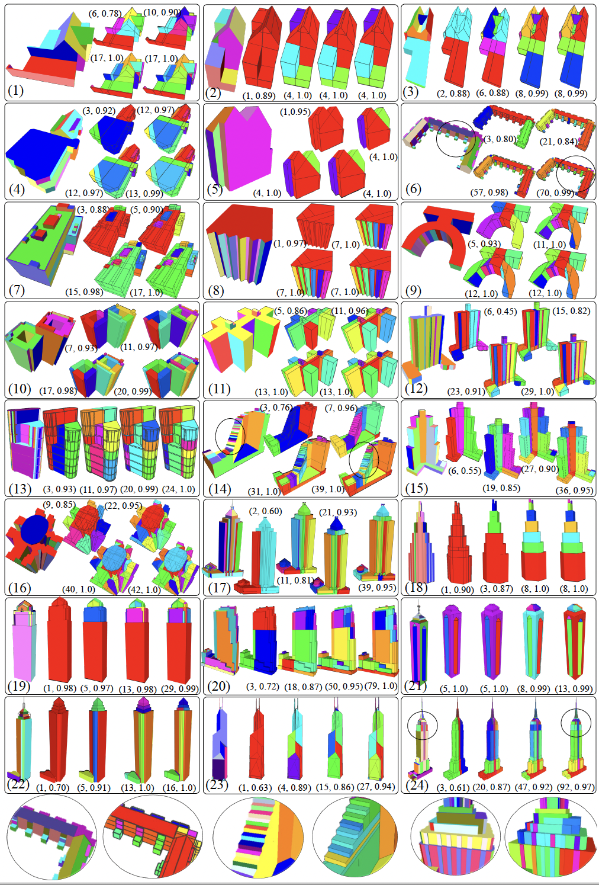
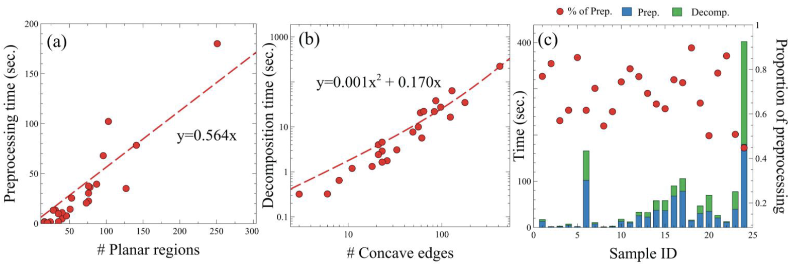
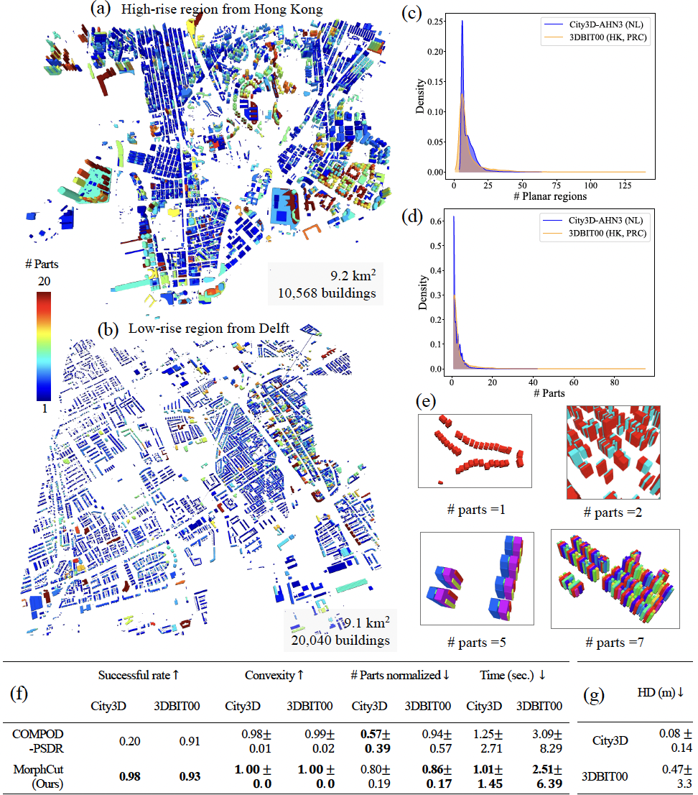

# MorphCut
This repository contains the implementation, test data, and supplementary materials of our paper "MorphCut: an efficient convex decomposition method of 3D building models for urban morphological analytics" published on International Journal of Geographical Information Science (DOI: [10.1080/13658816.2025.2562251](https://doi.org/10.1080/13658816.2025.2562251))
## 🧠 Intro
MorphCut is an efficient 3D convex decomposition algorithm designed for **mass-aware urban morphological analysis**.
It automatically splits complex 3D building models into **meaningful, convex, and mass-aligned parts, enabling large-scale studies of urban form, daylight, ventilation, and shading**.



Unlike existing 3D GIS methods that overlook internal massing features such as **courtyards and setbacks**, MorphCut captures these characteristics by combining **topological preprocessing** with **morphological principles—including planarity, regularity, and Gestalt grouping**.



Through this work, we aim to contribute a practical and scalable tool that supports 3D morphological analytics and encourages further exploration of mass-aware representation and analysis in urban studies.

## 💻 Usage
### Step 1 - Install dependencies
- CGAL (ver 6.0) (Use the modified version in the uploaded cgal.zip)
- Qt6 (For visualization in runtime)
- Eigen
- RapidJSON
- NLopt
- SDF (Use the modified version in the uploaded sdf.zip)
- OpenMP
### Step2 - Build from source
type the commands in the terminal:
cd code & mkdir build & cd build & cmake .. & make
### Step 3 - Run the compiled executable
now you are in the build directory, type in the terminal:
./bcd path-to-sample.off
To test a sample, users can unzip the data.zip, and then keep the folder structure as it is, and then pass the sample.off in the folder to the bcd executable. A configuration file customizing the parameters is named sample.off_config.json in the same folder.
e.g., ./bcd /test_MorphCut/data/sample1/sample1.off
### Step 4 - Inspect the results
Results are saved in the same directory as the original sample.off file.

- sample.off_reconstruction.off is the reconstructed model with topological errors removed.
- Files named sample.off_xxx_lod_xxx.off are the decomposition results at different Levels of Detail (LoDs).
You can easily visualize the .off files online using [3dviewer.net](https://3dviewer.net)

❗ Note: Visualization in MeshLab or CloudCompare on Windows may fail to render some faces in the current results.

### Tested platforms
We mainly tested MorphCut on Linux and MacOS:
- MacOS, Sequoia 15.2
- Windows Subsystem for Linux (WSL)
- Ubuntu 24
- Linux-based High performance facilities

## 📊 Results & Performance
We selected 24 test buildings from the three public building datasets: City3D, 3DBIT00, and NYC3D. The selection was based on the representativeness of building morphology, covering diverse styles and levels of shape complexity. The samples range from simple, small houses to highly complex, iconic buildings. Results by MorphCut at different LoDs are presented in the following image. ($\bullet$, $\bullet$) indicate the number of decomposed parts and the average convexity, respectively.



Processing time increases proportionally with the number of planar regions and concave edges.



In the large-scale tests on the building models from Delft and Hong Kong (over 30,000 buildings / 18.3 km²), MorphCut achieved:



- 98% success rate in low-rise regions (+78% vs. second-best)
- 93% success rate in high-rise regions (+2%)
- 13 hours total runtime, about 3 hours faster than alternatives
- 0.25 m average deviation in geometric fidelity

## Limitations
Our method has several limitations, including the need for manual resolution tuning for optimal preprocessing, occasional sub-optimal results due to acceleration (Figure E.2), cutting or classification errors (Figure E.3), limited robustness to severe topological defects and non-manifold geometry (Figure E.4), long processing time for complex iconic buildings, and the lack of semantic or appearance-based reasoning. Visual details are provided in Appendix E. 

## Citation
```bib
@article{wu2025morphcut,
  title={MorphCut: an efficient convex decomposition method of 3D building models for urban morphological analytics},
  author={Wu, Yijie and Xue, Fan and Nan, Liangliang and Wu, Longyong and Stoter, Jantien and Yeh, Anthony GO},
  journal={International Journal of Geographical Information Science},
  pages={1--23},
  year={2025},
  publisher={Taylor \& Francis}
}
```